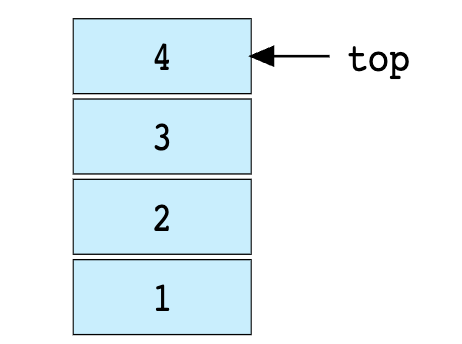
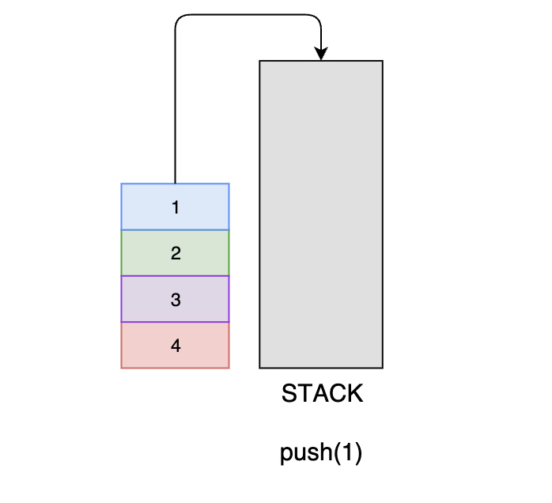
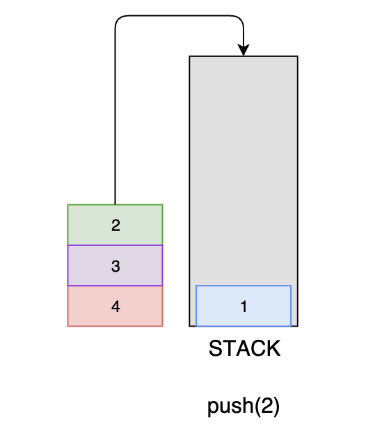
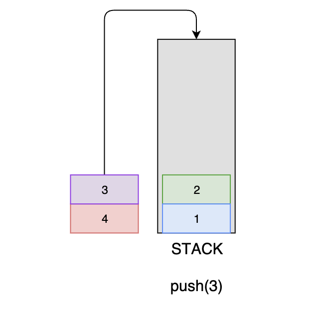
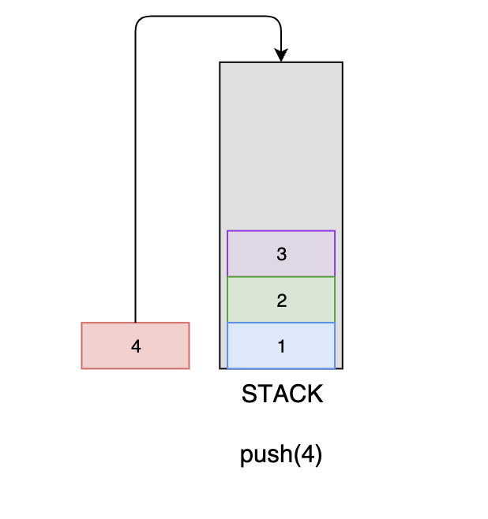
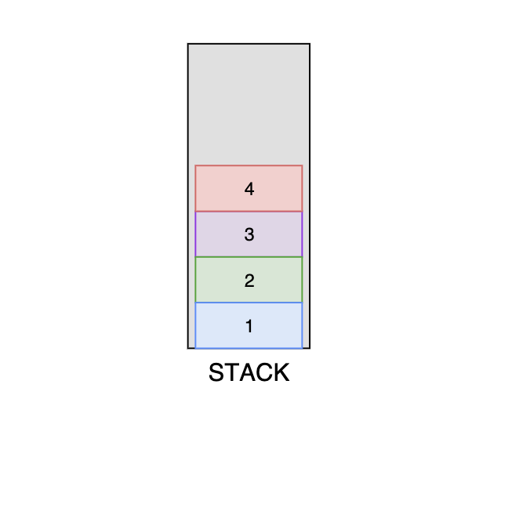
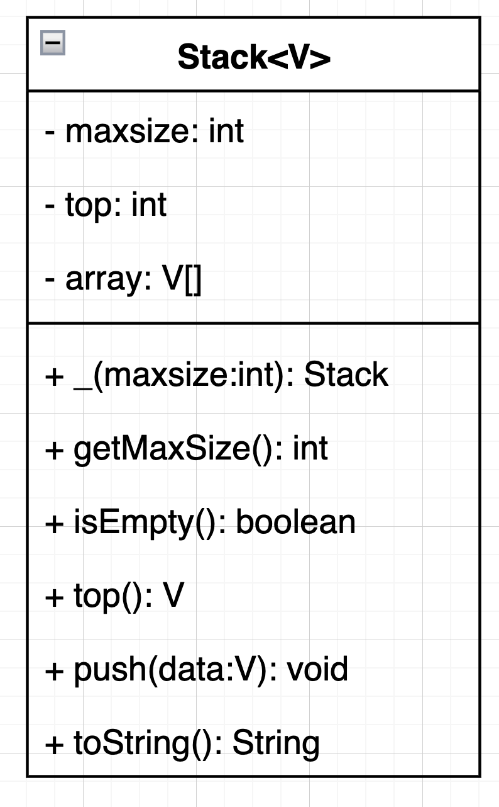

# What is a Stack?

In this lesson, we will be introduced to the stack data structure, its uses, and its functionality.

## Introduction

We are all familiar with the famous Undo option, which is present in almost every application. Have you ever wondered how it works? The idea is that you store the previous states of your work (which are limited to a specific number), in the memory in such an order that the last one appears first. This can’t be done just by using arrays, which is why the Stack comes in handy.

You can think of the Stack as a container, in which we can add items and remove them. Only the top of this container is open, so the item we put in first will be taken out last, and the items we put in last will be taken out first. This is called the last in first out (LIFO) ordering.

A real-life example of a Stack can be a pile of books placed in a vertical order. So, to get the book that’s somewhere in the middle, you need to remove all the books placed on top of it. That is how the LIFO method works. The following figure illustrates a Stack:

## What are Stacks Used for? 

A stack is one of the most fundamental data structures. Its implementation is very simple, yet it can be used to solve complex problems!

There are many computer algorithms like Depth First Search and Expression Evaluation Algorithm, etc., which are dependent on stacks to run perfectly. Stacks are used for the below actions:

* To backtrack to the previous task/state, e.g., in a recursive code

* To store a partially completed task, e.g., when you are exploring two different paths on a Graph from a point while calculating the smallest path to the target.

## How do stacks work? #

A Stack can be implemented in many ways, but a typical Stack must offer the following functionalities:

| Functions | Descriptions |
| --------- | ----------- |
| push | Inserts an element at the top |
| pop | Removes an element from the top and returns it |
| isFull | Returns true if the stack is full and false otherwise |
| isEmpty | Returns true if the stack is empty and false otherwise |
| top | Returns the element at the top (i.e., the one added most recently) |

The entire functionality of a stack depends on the push and pop methods listed in the table. The following animation shows how to push elements in the given stack and then pop them off.

## Explanation

When you insert an element into the stack, the variable that stores the position of the top element would be pointing to the number below it. So, you will have to update its value every time you insert a new element into the stack. Similarly, the value of the top variable will also change when you delete an element from the stack. It’s a good practice to update the top variable first, and then perform the operation; otherwise, the variable would be pointing to nothing or a wrong value in case of insertion.

## Implementation

Every programming language comes with the basic functionality of Stack. In Java, you can use the pre-built class of Stack by importing it to your program. However, you can manually implement a stack and extend its functionality for your use.

Stacks can either be implemented using arrays or linked lists. It has yet to be concluded which implementation is more efficient, as both data structures offer different variations of Stack. However, stacks are generally implemented using arrays because it takes less space; we don’t need to store an additional pointer like in a linked list.

A typical Stack must contain the following standard methods:

* push (datatype V)
* datatype pop()
* boolean isEmpty()
* datatype top()

Use the UML below to complete the assignment, include all Unit Test

